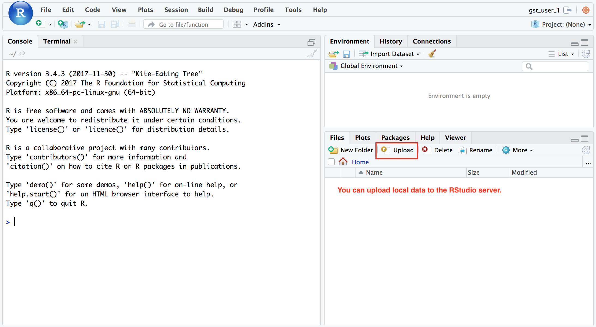

<style>
pre code, pre, code {
  white-space: pre !important;
  overflow-x: scroll !important;
  word-break: keep-all !important;
  word-wrap: initial !important;
}
</style>

```{r setup, include=FALSE}
knitr::opts_chunk$set(echo = TRUE, eval = FALSE)
```

## Workshop Environment

**RStudio Server Account**

Select an user account (row) from this [google sheet](https://docs.google.com/spreadsheets/d/1eR3eR62F1jozQHrZhTrnFEtRfVa1D6n52nXzPVIwfTA/edit#gid=0) and put your name on the right column to mark that this user account has been used.

**Open the URL in the first row in a new browser tab (copy URL and paste in tab, hit [enter])**

**Use the `upload` button to upload local files to the Server.**



### Install packages (optional)

You can use the code below to install R packages in the RStudio server.

```{r}
dir.create('~/my-r-lib')
.libPaths('~/my-r-lib')
install.packages('ggplot2')
```


## Build Workshop Environment (admin users only)
### RStudio Docker on Jetstream

Launch a Jetstream image with Docker installed on Jetstream. Then run the following to luanch an RStudio server.

```{bash}
sudo su

# docker pull rocker/rstudio

# docker run --name=gst_dv -d -p 80:8787 rocker/rstudio

docker pull mingchen0919/gst-dv-rstudio
docker run --name=gst_dv -d -p 80:8787 mingchen0919/gst-dv-rstudio
```

### Create 30 new users

```
# login to the rstudio container
docker exec -it gst_dv bash

# create users in the rstudio container
for id in $(seq 1 30)
do
  echo "gst_user_${id}:passwd_user_${id}::::/home/gst_user_${id}:" | newusers
done
```
