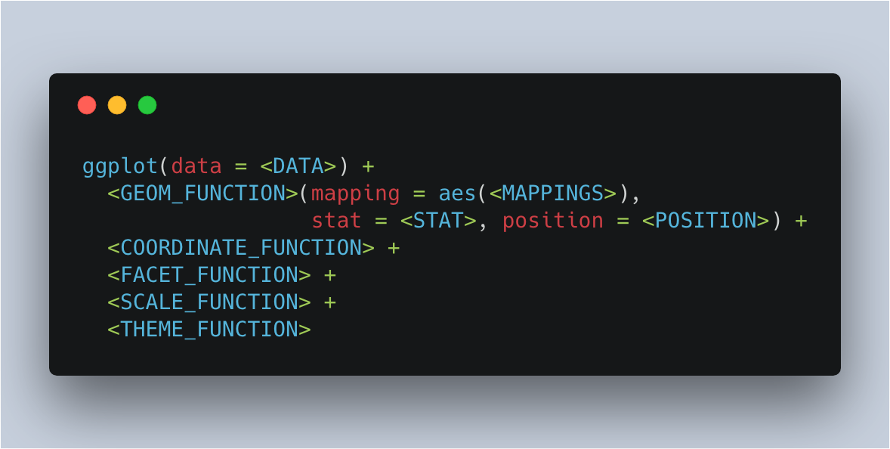

<style>
pre code, pre, code {
  white-space: pre !important;
  overflow-x: scroll !important;
  word-break: keep-all !important;
  word-wrap: initial !important;
}

.lleft {
  text-align: left;
  float: left;
  width:50%;
  z-index:-10;
  border: 5px solid #fff;
}
</style>

```{r setup, include=FALSE}
knitr::opts_chunk$set(echo = FALSE, eval = TRUE)
options("width" = 200)
```

## Import libraries 

```{r, echo=TRUE}
library(ggplot2)
library(gridExtra)
```

## Example data

The data was extracted from the 1974 Motor Trend US magazine, and comprises fuel consumption and 10 aspects of automobile design and performance for 32 automobiles (1973–74 models).

```{r, echo=FALSE}
mtcars
```

```{r, echo=TRUE, eval=FALSE}
help(mtcars)
```


## Plotting template



* **GEOM_FUNCTION**: use a geometric object to represent your data.
    + ***MAPPINGS***: associate data values with visual values. e.g., categorial data -> different colors.
    + ***STAT***: use raw data values or calculate new values from raw values.
    + ***POSITION***: adjust overlapped geometric objects.
* **COORDINATE_FUNCTION**: type of coordinate systems.
* **FACET_FUNCTION**: divide plots into subplots
* **SCALE_FUNCTION**: how data values are mapped to visual values.
* **THEME_FUNCTION**: the apperance of graph components that is not directly related to the mappings.

## GEOM_FUNCTION

### Specify a geometric object to represent your data

```{r, class.source="left"}
p1 = ggplot(data = mtcars) + 
  geom_point(mapping = aes(x = disp, y = hp), 
             stat = "identity") +
  coord_cartesian() + 
  scale_color_discrete() +
  theme()
```


```{r, class.source="left"}
p2 = ggplot(data = mtcars) + 
  geom_line(mapping = aes(x = disp, y = hp), 
             stat = "identity") +
  coord_cartesian() + 
  scale_color_discrete() +
  theme()
```

##

```{r fig.align='center', echo=FALSE}
grid.arrange(p1, p2, ncol = 2)
```


## Mappings

### From data values to visual values


```{r, class.source="left"}
p1 = ggplot(data = mtcars) + 
  geom_point(mapping = aes(x = disp, y = hp,
                           shape = as.factor(gear)),
             stat = "identity") +
  coord_cartesian() + 
  scale_color_discrete() +
  theme()
```


```{r, class.source="left"}
p2 = ggplot(data = mtcars) + 
  geom_point(mapping = aes(x = disp, y = hp,
                           color = as.factor(gear)), 
             stat = "identity") +
  coord_cartesian() + 
  scale_color_discrete() +
  theme()
```

```{r fig.align='center', echo=FALSE}
grid.arrange(p1, p2, ncol = 2)
```


## Stat

### transform your data, then map the transformed data values to visual values.

```{r, class.source="left"}
p1 = ggplot(data = mtcars) + 
  geom_point(mapping = aes(x = disp, y = hp),
             stat = "identity") +
  coord_cartesian() + 
  scale_color_discrete() +
  theme()
```


```{r, class.source="left"}
p2 = ggplot(data = mtcars) + 
  geom_bin2d(mapping = aes(x = disp, y = hp), 
             stat = "bin2d") +
  coord_cartesian() + 
  scale_color_discrete() +
  theme()
```

```{r fig.align='center', echo=FALSE}
grid.arrange(p1, p2, ncol = 2)
```


## COORDINATE SYSTEM

```{r, class.source="left"}
p1 = ggplot(data = mtcars) + 
  geom_point(mapping = aes(x = disp, y = hp),
             stat = "identity") +
  coord_cartesian() + 
  scale_color_discrete() +
  theme()
```


```{r, class.source="left"}
p2 = ggplot(data = mtcars) + 
  geom_point(mapping = aes(x = disp, y = hp), 
             stat = "identity") +
  coord_polar() + 
  scale_color_discrete() +
  theme()
```

```{r fig.align='center', echo=FALSE}
grid.arrange(p1, p2, ncol = 2)
```


## Facet

### Split data into multiple plots.

```{r, class.source="left"}
p1 = ggplot(data = mtcars) + 
  geom_point(mapping = aes(x = disp, y = hp),
             stat = "identity") +
  coord_cartesian() + 
  facet_null() +
  scale_color_discrete() +
  theme()
```


```{r, class.source="left"}
p2 = ggplot(data = mtcars) + 
  geom_point(mapping = aes(x = disp, y = hp), 
             stat = "identity") +
  coord_cartesian() + 
  facet_grid(am ~ .) +
  scale_color_discrete() +
  theme()
```

```{r fig.align='center', echo=FALSE}
grid.arrange(p1, p2, ncol = 2)
```

## Scale

### Control how data values are mapped to visual values and the mapping related attributes.

```{r, class.source="left"}
p1 = ggplot(data = mtcars) + 
  geom_point(mapping = aes(x = disp, 
                           y = hp,
                           color = as.factor(gear)),
             stat = "identity") +
  coord_cartesian() + 
  scale_color_discrete(
    
    
  ) +
  theme()
```


```{r, class.source="left"}
p2 = ggplot(data = mtcars) + 
  geom_point(mapping = aes(x = disp, 
                           y = hp, 
                           color = as.factor(gear)), 
             stat = "identity") +
  coord_cartesian() + 
  scale_color_manual(name = 'gear',
                     values = c('3' = 'blue',
                                '4' = 'green',
                                '5' = 'red'),
                     labels = c('3->blue', '4->green', '5->red')) +
  theme()
```

```{r fig.align='center', echo=FALSE}
grid.arrange(p1, p2, ncol = 2)
```


## Theme

### The general appearance

```{r, class.source="left"}
p1 = ggplot(data = mtcars) + 
  geom_point(mapping = aes(x = disp, y = hp),
             stat = "identity") +
  coord_cartesian() + 
  scale_color_discrete() +
  theme()
```


```{r, class.source="left"}
p2 = ggplot(data = mtcars) + 
  geom_point(mapping = aes(x = disp, y = hp), 
             stat = "identity") +
  coord_cartesian() + 
  scale_color_discrete() +
  theme_classic()
```

```{r fig.align='center', echo=FALSE}
grid.arrange(p1, p2, ncol = 2)
```
