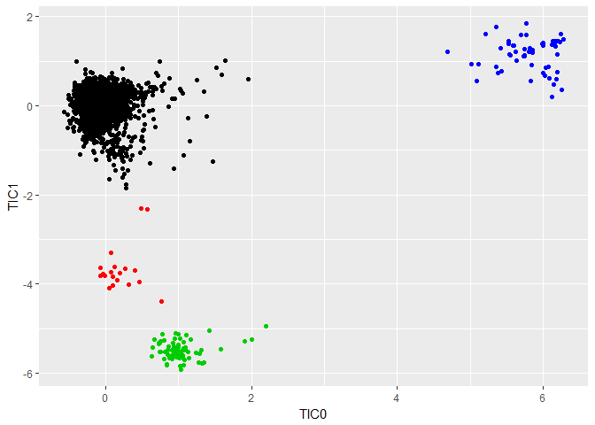
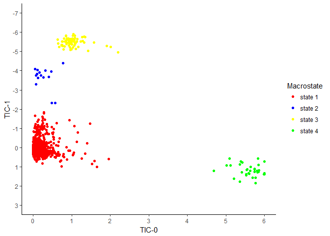
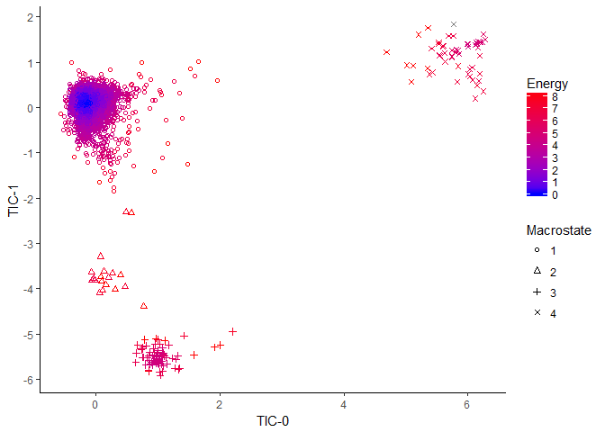
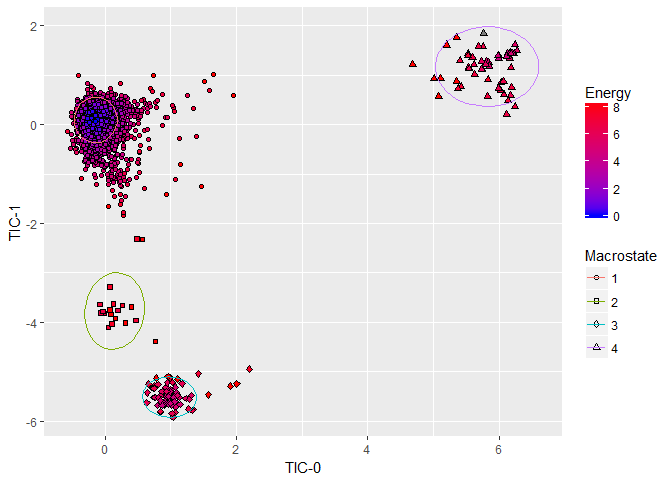

Import Data
-----------

    #---Loading data
    load(url('https://github.com/MingChen0919/gst-colloquium-workshop-2018/raw/master/content/datasets/GST-WS.RData'))

Load ggplot2 library
--------------------

    #---loading ggplot library
    library(ggplot2)

Visualization
-------------

### Plot One; collective variables and macrostates

-   Geom object: point
    -   TIC-0 -&gt; x
    -   TIC-1 -&gt; y
    -   Macrostate -&gt; color

<!-- -->

    #---plot one
    ggplot(energy_tics) +
      geom_point(mapping = aes(x = TIC0, y = TIC1, color = as.factor(macrostate)),
                 stat = "identity", 
                 position = "identity") +
      coord_cartesian() +
      facet_null() +
      
      ##----map data values to visual values
      scale_x_continuous() +
      scale_y_continuous() +
      theme()

### Plot Two; manipulating axes, point colors

-   Geom object: point
    -   TIC-0 -&gt; x
    -   TIC-1 -&gt; y
    -   Macrostate -&gt; color
-   Plot edits
    -   Set the axis labels (breaks)  
    -   Set the axis limits (limits)  
    -   Change axis orientation (trans = "reverse")  
    -   Change colors for macrostates (scale\_color\_manual())  
    -   Set labels for macrostates (breaks; labels)  
    -   Change theme (theme\_classic())

<!-- -->

    #---plot two
    ggplot(energy_tics) +
      geom_point(mapping = aes(x = TIC0, y = TIC1, color = as.factor(macrostate)),
                 stat = "identity", 
                 position = "identity") +
      coord_cartesian() +
      facet_null() +
      
      ##----map data values to visual values
      scale_x_continuous(name = "TIC-0", 
                         breaks = c(0, 1, 2, 3, 4),
                         limits = c(0, 4)) +
      scale_y_continuous(name = "TIC-1",
                         breaks = -16:5, 
                         trans = "reverse",
                         limits = c(5, -16)) +
      scale_color_manual(values = c("0" = "black", "1" = "red", "2" = "blue", "3" = "yellow", "4" = "green", "5" = "purple", "6" = "pink", "7" = "grey", "8" = "brown", "9" = "coral", "10" = "mediumaquamarine", "11" = "orange"),
                         name = "Macrostate", 
                         breaks = c(0,1,2,3,4,5,6,7,8,9,10,11),
                         labels = c('state 0', 'state 1', 'state 2', 'state 3', 'state 4', 'state 5', 'state 6', 'state 7', 'state 8', 'state 9', 'state 10', 'state 11')) + 
      theme_classic()

### Plot Three; add additional factor to visualize

-   Geom object: point
    -   TIC-0 -&gt; x
    -   TIC-1 -&gt; y
    -   Macrostate -&gt; shape
    -   Energy -&gt; color
-   Plot edits
    -   Energy added as parameter
    -   Change macrostate label

<!-- -->

    #---plot three
    ggplot(energy_tics) +
      geom_point(mapping = aes(x = TIC0, y = TIC1, shape = as.factor(macrostate), color = Energy),
                 stat = "identity", position = "identity") +
      coord_cartesian() +
      facet_null() +
      
      ##----map data values to visual values
      scale_x_continuous() +
      scale_y_continuous() +
      scale_color_gradient() +
      scale_shape_discrete() +
      theme() +
      
      ##---change macrostate legend label
      labs(shape="Macrostate") 

### Plot Four; manipulate color gradients, specify point shapes

-   Geom object: point
    -   TIC-0 -&gt; x
    -   TIC-1 -&gt; y
    -   Macrostate -&gt; shape
    -   Energy -&gt; color
-   Plot edits
    -   Change color gradient for energy (scale\_color\_gradient)
    -   Specify shapes for macrostates

<!-- -->

    #---plot four
    ggplot(energy_tics) +
      geom_point(mapping = aes(x = TIC0, y = TIC1, shape = as.factor(macrostate), color = Energy),
                 stat = "identity", position = "identity") +
      coord_cartesian() +
      facet_null() +
      
      ##----map data values to visual values
      scale_x_continuous(name = "TIC-0") +
      scale_y_continuous(name = "TIC-1",
                         breaks = -15:5) +
      scale_color_gradient(low="blue", high="red",
                           breaks = 0:11) +
      scale_shape_manual(values = c("0" = 0, "1" = 1, "2" = 2, "3" = 3, "4" = 4, "5" = 5, "6" = 6, "7" = 7, "8" = 8, "9" = 9, "10" = 10, "11" = 11),
                         name = "Macrostate") +
      theme_classic()

### Plot Five; add confidence ellipses

-   Geom object: point
    -   TIC-0 -&gt; x
    -   TIC-1 -&gt; y
    -   Macrostate -&gt; shape
    -   Energy -&gt; color
-   Geom object: path
    -   TIC-0 -&gt; x
    -   TIC-1 -&gt; y
    -   Macrostate -&gt; color
    -   confidence ellipse -&gt; stat
-   Plot edits
    -   Change legend labels (labs())

<!-- -->

    #---plot five
    ggplot(energy_tics) +
      geom_point(mapping = aes(x = TIC0, y = TIC1, shape = as.factor(macrostate)),
                 stat = "identity", position = "identity", inherit.aes = FALSE) +
      geom_path(mapping = aes(x = TIC0, y = TIC1, color = as.factor(macrostate)), 
                stat = "ellipse", inherit.aes = FALSE) + 
      coord_cartesian() +
      facet_null() +
      
      ##----map data values to visual values
      scale_x_continuous(name = "TIC-0") +
      scale_y_continuous(name = "TIC-1") +
      scale_shape_manual(values = c("0" = 0, "1" = 1, "2" = 2, "3" = 3, "4" = 4, "5" = 5, "6" = 6, "7" = 7, "8" = 8, "9" = 9, "10" = 10, "11" = 11)) +
      scale_color_discrete() +
      theme(legend.position = "bottom") +
      
      ##---change macrostate legend label
      labs(shape="Macrostate", color = "Macrostate") 

