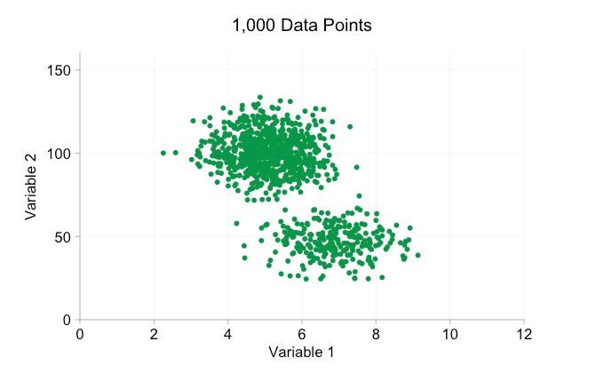
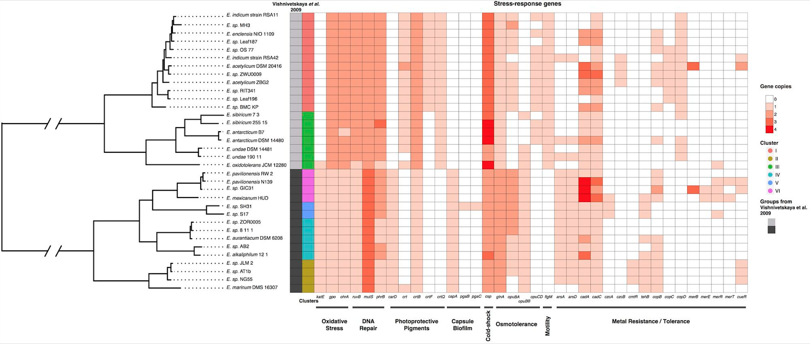
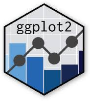
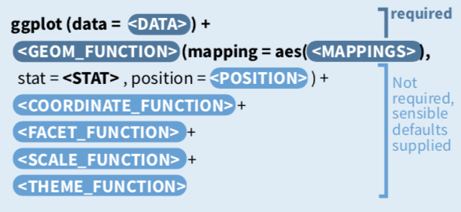

```{r setup, include=FALSE}
knitr::opts_chunk$set(echo = TRUE, fig.width=12, fig.height=4)
library(emo)
```


## Big Biological Data {.flexbox .vcenter}

* Genomic and trancriptomic sequencing
* Molecular modeling and dynamics
* Mass spectrometry

    
## {.flexbox .vcenter}

<h1>Challenges in visualizing big data``r emo::ji("disappointed")``?</h2>


## Scatter Plot {.flexbox .vcenter}

The pattern is gone when there are too many data points!



<font size="-1">Reference: https://www.infragistics.com/community/blogs/b/tim_brock/posts/too-big-data-coping-with-overplotting</font>


## Solution {.flexbox .vcenter}


## Network {.flexbox .vcenter}

Beatiful network plot, but what can you get from this plot?


<font size="-1">Reference:https://matthewlincoln.net/2014/12/20/adjacency-matrix-plots-with-r-and-ggplot2.html</font>

## Heatmap {.flexbox .vcenter}




## Data Visualization {.flexbox .vcenter}

* **Figure: a combination of geometric objects**
    - dots
    - lines
    - areas
* **Geometric objects have attributes**
    - location
    - color
    - size
    - shape
    - transparency
* **Data visualization**: mapping categorical/numeric variables to geometric objects and their attributes


## ggplot2 {.flexbox .vcenter}




## The Grammar of ggplot2 {.flexbox .vcenter}





## Learning Goals {.flexbox .vcenter}

* Several skills in big data visualization
* The grammar of ggplot2
* Manipulate aesthetics and plot appearance
* Create publication-ready plots
